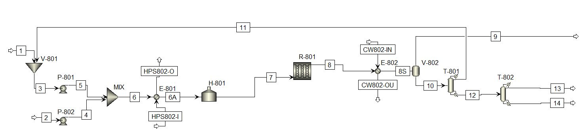
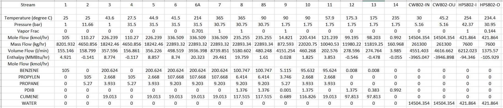

# PFD
  
  
  

## Equipment Summary  
**Heat Exchangers**  

**Pumps**  
P-801:  
Centrifugal pump/electric drive  
Carbon Steel  
Actual Power: 24.24 kW  
Efficiency: 75%  

P-802:  
Centrifugal pump/electric drive  
Carbon Steel  
Actual Power: 7.0 kW  
Efficiency: 75%  

**Tanks (not shown on PFD)**  
TK-801:  
storage tank for benzene.  
V = 450m^3  

TK-802:  
storage tank for propylene.  
V = 450m^3  

**Fired Heater**  
Required heat load = 9641 MJ/h  
Design heat load = 10,000 MJ/h added to fluid.  
Tubes are carbon steel  
70% thermal efficiency  
P = 31.5 bar

**Reactor**  
R-801:  
Carbon steel shell-and-tube packed bed, catalyst parameters are specified by Appendix C.6.  
V = 6.5 m^3  
375 tubes, 7.62 cm ID, 6 m long  
P = 30.75 bar  
T = 365 degree C  

**Distillation Columns**  
T-801:  
Carbon steel  
14 carbon steel trays with total condenser and reboiler  
50% efficient trays  
Feed on tray 7  
Reflux ratio = 0.44  
Tray spacing is 24 in  
Column height = 8.69 m 
Diameter = 1.13 m  
P = 1.75 bar  

T-802:  
Carbon steel  
18 carbon steel trays with total condenser and reboiler  
50% efficient trays  
Feed on tray 9  
Reflux ratio = 0.63  
Tray spacing is 24 in  
Column height = 11.13 m 
Diameter = 1.26 m  
P = 1.75 bar  

**Vessels**  
V-801:  
Carbon steel  
Horizontal  
L/D = 3  
V = 6.46 m  

V-802:  
Carbon steel  
Vertical  
L/D = 5.2  
V = 4.08 m  

V-803:  
Carbon steel  
Horizontal  
L/D = 2.5  
V = 8.04 m  

V-804:  
Carbon steel  
Horizontal  
L/D = 4.06  
V = 13.06 m  
